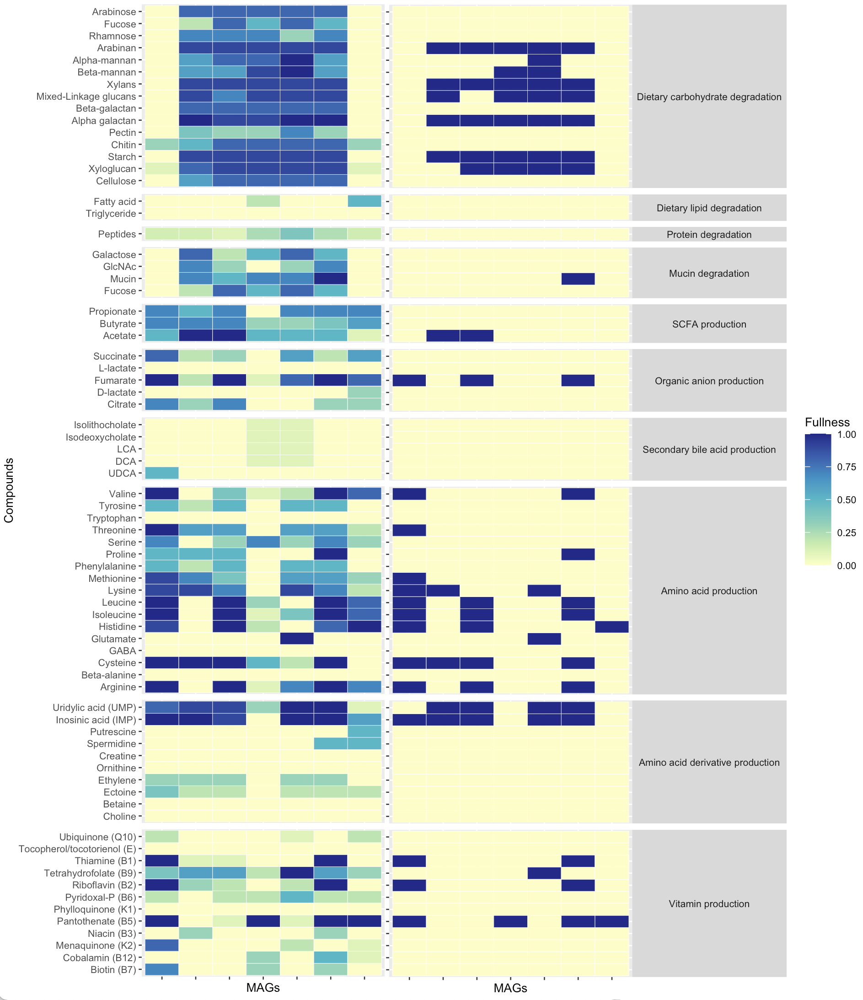

# **DAMMA**: Distillation of Animal-associated Microorganisms' Metabolic Annotations
DAMMA is an R package that provides a suite of functions to compute biologically meaningful functional capacity indices of microbial strains and communities from genome-resolved metagenomic and associated metatranscriptomic data. Functional pathways included in the package produce either the degradation or synthesis of biomolecular compounds that are known to be relevant for animal biology, thus providing an estimation of the biological contribution individual microbial strains and collective communities can make to their hosts. DAMMA incorporates scripts to produce meaningful functional profiles, but also to account for technical distortion factors, such as MAG completeness, which are known to affect functional characterisations and analyses of microbiome data.

## Quick start
DAMMA has been developed as an R package, thus basic knowledge of the R environment is required for an efficient use of the software. The only dependency of DAMMA is the package suite [tidyverse](https://www.tidyverse.org/packages/).

### Install DAMMA
DAMMA can be directly installed from this Github repository using install_github() function included in the [devtools](https://www.r-project.org/nosvn/pandoc/devtools.html) package.
```
install.packages("devtools") #only if devtools is not installed previously
library(devtools)
install_github("anttonalberdi/DAMMA")
```

### Load DAMMA
Every time you want to use the package, you need to load the library, which will load support data automatically.
```
library(DAMMA)
```

### Uninstall DAMMA
DAMMA can be uninstalled using the following commands:
```
detach_package(DAMMA)
remove.packages("DAMMA")
```

### Updating DAMMA
To ensure you are using the laters version of the software, we recommend to:
1) Uninstall DAMMA (see instructions above)
2) Restart R or Rstudio session (to avoid cache issues)
3) Install DAMMA (see instructions above)

## Acknowledgement and citation
DAMMA is still under development, and we are working on the scientific publication that will describe the rationale and functionalities of the package. In the meanwhile, we encourage users to provide the link to this repository whenever DAMMA needs to be acknowledged.

## Using DAMMA with metagenomic data

### Input data
DAMMA only requires an annotations table containing genome (or metagenome-assembled genome, MAG) identifiers and annotations. Such tables are usually quite large, so using the R package data.table is recommended for smooth processing of the data.

```
#Load annotations
library(data.table)
#annotations_file="/mydir/gene_annotations_file.tsv"
#gene_annotations <- fread(annotations_file)
```

DAMMA contains example data sets that are loaded along with the pathway table. These data are used in this documentation for showcasing DAMMA scripts.

```
#Load DAMMA library. Automatically loads support data and example data sets as well.
library(DAMMA)

#Visualise example annotations
head(gene_annotations)

#Visualise pathway table
head(pathway_table)
```

### Run distillation
The damma() function requires specifying in which column(s) to find Genome (MAG) identifiers and annotation data.
- genomecol: number of column containing Genome (MAG) identifies.
- keggcol: index(es) of column(s) containing KO codes (eg: K00169). The script parses any annotation with the pattern "K*****"" in the indicated column.
- eccol: index(es) of column(s) containing EC codes (eg: EC:3.2.4.15). The script parses any annotation with the pattern "EC:*.*.*.*" in the indicated column.
- pepcol: index(es) of column(s) containing peptidase codes (eg: C03H). The script requires the peptidase families to be without any surroundig texts, because the code layout is not specific enough for efficient parsing.

```
#Using example data
MCI_table <- damma(gene_annotations,pathway_table,genomecol=2,keggcol=9,eccol=c(10,19),pepcol=12)
```

### Apply MAG completeness correction factor
Functional attributes of MAGs are often not directly comparable due to different levels of completeness. A MAG with 70% of estimated completeness most likely misses genes that contribute to its functional repertoire, compared to another MAG with 100% completeness. Therefore, a direct comparison of these two MAGs is likely to yield distorted results. In an attempt to minimise the impact of MAG completeness in functional metagenomic analyses, DAMMA incorporates a completeness correction script, which models the relationship between function fullness and MAG completeness  across the entire dataset, to apply a correction factor to the raw module fullness values.

```
head(genome_quality)
MCI_table_corrected <- damma_correction(distilled_table,genome_completeness=genome_quality[,c(1:2)])
```

### Aggregrate raw distillates into 80 compounds

The raw fullness data can be aggregated to the compound level using the damma_compounds() function. These data are useful to obtain high-resolution functional information for statistical analyses that enable a large number of features.
```
MCI_table_compounds <- damma_compounds(MCI_table,pathway_table)
```

### Convert compounds into a binary table

DAMMA offers the possibility to convert the fullness table into a binary format by setting a cutoff threshold.
```
MCI_table_compounds_bin <- damma_binary(MCI_table_compounds,threshold=0.9)
```

### Aggregrate compounds into 11 core functions

The compounds data can be aggregated to the main functional levels using the damma_functions() function. These data are useful to obtain overall functional information for statistical analyses that required a reduced number of features.
```
MCI_table_functions <- damma_functions(MCI_table_compounds,pathway_table)
MCI_table_functions_bin <- damma_functions(MCI_table_compounds_bin,pathway_table)
```

### Compound-level heatmap

Functional data can be visualised as a heatmap using ggplot2.
```
library(data.table)
library(ggplot2)
library(RColorBrewer)

#Prepare input table
compounds_table_df <- melt(MCI_table_compounds)
colnames(compounds_table_df) <- c("MAGs","Compounds","MCI")
compounds_table_df2 <- merge(compounds_table_df,pathway_table,by.x="Compounds",by.y="Compound")
compounds_table_df2$Function <- as.factor(compounds_table_df2$Function)
compounds_table_df2$Function <- factor(compounds_table_df2$Function, levels=c("Polysaccharide degradation","Sugar degradation","Lipid degradation","Protein degradation","Mucin degradation","SCFA production","Organic anion production","Secondary bile acid production","Amino acid production","Amino acid derivative production","Vitamin production"))

#Plot heatmap
ggplot(compounds_table_df2, aes(x=MAGs, y=Compounds, fill=MCI, group=Function))+
  geom_tile(colour="white", size=0.1)+
  scale_y_discrete(guide = guide_axis(check.overlap = TRUE))+
  scale_x_discrete(guide = guide_axis(check.overlap = TRUE))+
  #scale_fill_gradientn(limits = c(0,1), colours = rev(c("#781a25","#d53e4f", "#f46d43", "#fdae61", "#fee08b", "#e6f598", "#abdda4", "#ddf1da","#f1faf0","#f4f4f4")))+
  scale_fill_gradientn(limits = c(0,1), colours=brewer.pal(7, "YlGnBu"))+
  facet_grid(Function ~ ., scales = "free", space = "free")+
  theme_grey(base_size=8)+
  theme(strip.text.y = element_text(angle = 0),axis.text.x = element_text(angle = 90, vjust = 0.5, hjust=1))
```

Combining DAMMA with ggplot2, it is possible to produce visual representations of both continuous fullness values as well as binary versions of it.



### Function-level heatmap

Functional data can be visualised as a heatmap using ggplot2.
```
library(data.table)
library(ggplot2)
library(RColorBrewer)

#Prepare input table
pathway_table_df <- melt(MCI_table_functions)
colnames(pathway_table_df) <- c("MAGs","Functions","MCI")
pathway_table_df$Function <- as.factor(pathway_table_df$Function)
pathway_table_df$Function <- factor(pathway_table_df$Function, levels=c("Polysaccharide degradation","Sugar degradation","Lipid degradation","Protein degradation","Mucin degradation","SCFA production","Organic anion production","Secondary bile acid production","Amino acid production","Amino acid derivative production","Vitamin production"))
#Plot heatmap
ggplot(pathway_table_df, aes(x=MAGs, y=Functions, fill=MCI))+
  geom_tile(colour="white", size=0.1)+
  scale_y_discrete(guide = guide_axis(check.overlap = TRUE))+
  scale_x_discrete(guide = guide_axis(check.overlap = TRUE))+
  #scale_fill_gradientn(limits = c(0,1), colours = rev(c("#781a25","#d53e4f", "#f46d43", "#fdae61", "#fee08b", "#e6f598", "#abdda4", "#ddf1da","#f1faf0","#f4f4f4")))+
  scale_fill_gradientn(limits = c(0,1), colours=brewer.pal(7, "YlGnBu"))+
  facet_grid(Function ~ ., scales = "free", space = "free")+
  theme_grey(base_size=8)+
  theme(strip.text.y = element_text(angle = 0),axis.text.x = element_text(angle = 90, vjust = 0.5, hjust=1))
```

## Using DAMMA with metatranscriptomic data
The damma_expression() function requires specifying in which column(s) to find Gene identifiers, Genome (MAG) identifiers and annotation data.
- genecol: number of column containing Gene identifies.
- genomecol: number of column containing Genome (MAG) identifies.
- keggcol: index(es) of column(s) containing KO codes (eg: K00169).
- eccol: index(es) of column(s) containing EC codes (eg: EC:3.2.4.15).
- pepcol: index(es) of column(s) containing peptidase codes (eg: C03H).

```
data(damma_data)
head(gene_expression)

MCI_expression_table <- damma_expression(gene_expression,gene_annotations,pathway_table,genecol=1,genomecol=2,keggcol=9,eccol=c(10,19),pepcol=12)
```

The output of damma_expression() is a list of tables containing functional expression values grouped by genome (one table with various samples per genome). Depending on the downstream analyses, researchers might need to organise the information differently.  Using the function sweep_matrix_list() it is possible to change the organisation of the information to a list of tables grouped by sample (one table with various genomes per sample).

```
MCI_expression_table2 <- sweep_matrix_list(MCI_expression_table)
```

Using lapply(), the damma_compounds() function can be applied to the list of expression tables.
```
MCI_expression_table2_compounds <- lapply(MCI_expression_table2,function(x) damma_compounds(x,pathway_table))
```

A compound level heatmap can be plotted per sample
```
library(data.table)
library(ggplot2)
library(RColorBrewer)

#Prepare input table
compounds_table_df <- melt(MCI_expression_table2_compounds)
colnames(compounds_table_df) <- c("MAGs","Compounds","Expression","Sample")
compounds_table_df$Expression <- log(compounds_table_df$Expression)
compounds_table_df$Expression[compounds_table_df$Expression == "-Inf"] <- NA
compounds_table_df$Expression[compounds_table_df$Expression < 0] <- NA
compounds_table_df2 <- merge(compounds_table_df,pathway_table,by.x="Compounds",by.y="Compound")
compounds_table_df2$Function <- as.factor(compounds_table_df2$Function)
compounds_table_df2$Function <- factor(compounds_table_df2$Function, levels=c("Polysaccharide degradation","Sugar degradation","Lipid degradation","Protein degradation","Mucin degradation","SCFA production","Organic anion production","Secondary bile acid production","Amino acid production","Amino acid derivative production","Vitamin production"))

#Plot heatmap
ggplot(compounds_table_df2, aes(x=MAGs, y=Compounds, fill=Expression, group=Function))+
  geom_tile(colour="white", size=0.1)+
  scale_y_discrete(guide = guide_axis(check.overlap = TRUE))+
  scale_x_discrete(guide = guide_axis(check.overlap = TRUE))+
  #scale_fill_gradientn(limits = c(0,1), colours = rev(c("#781a25","#d53e4f", "#f46d43", "#fdae61", "#fee08b", "#e6f598", "#abdda4", "#ddf1da","#f1faf0","#f4f4f4")))+
  scale_fill_gradientn(colours=brewer.pal(7, "YlGnBu"),na.value="#f4f4f4")+
  facet_grid(Function ~ Sample, scales = "free", space = "free")+
  theme_grey(base_size=8)+
  theme(strip.text.y = element_text(angle = 0),axis.text.x=element_blank())
```

## Using DAMMA for community-level analysis
DAMMA can also compute community-level capacities to perform specific metabolic functions through computing MCIs based on the community-weighed average representations of genes. When working with large annotation files and hundreds of samples, R can run out of memory and yield an error like "Error: vector memory exhausted (limit reached?)". In such cases, allocate more virtual memory to your R environment.

If no information on relative abundances is provided, the function yields community-level MCIs assuming all Genomes have the same weight in the community.
```
community_MCI <- damma_community(gene_annotations,pathway_table,genomecol=2,keggcol=9,eccol=c(10,19),pepcol=12)
```

If a (relative) genome abundance table is provided, the function yields community-level MCIs adjusted to the relative representation of each Genome in the community.

```
community_MCI <- damma_community(gene_annotations,pathway_table,abundance_table=genome_counts,genomecol=2,keggcol=9,eccol=c(10,19),pepcol=12)
```

The pathway fullness values can be further distilled using the damma_compounds() function.
```
community_MCI_compounds <- damma_compounds(community_MCI,pathway_table)
```

And finally, the results can be visualised in a heatmap.
```
library(data.table)
library(ggplot2)
library(RColorBrewer)

#Prepare input table
compounds_table_df <- melt(community_MCI_compounds)
colnames(compounds_table_df) <- c("Samples","Compounds","MCI")
compounds_table_df2 <- merge(compounds_table_df,pathway_table,by.x="Compounds",by.y="Compound")
compounds_table_df2$Function <- as.factor(compounds_table_df2$Function)
compounds_table_df2$Function <- factor(compounds_table_df2$Function, levels=c("Polysaccharide degradation","Sugar degradation","Lipid degradation","Protein degradation","Mucin degradation","SCFA production","Organic anion production","Secondary bile acid production","Amino acid production","Amino acid derivative production","Vitamin production"))

#Plot heatmap
ggplot(compounds_table_df2, aes(x=Samples, y=Compounds, fill=MCI, group=Function))+
  geom_tile(colour="white", size=0.1)+
  scale_y_discrete(guide = guide_axis(check.overlap = TRUE))+
  scale_x_discrete(guide = guide_axis(check.overlap = TRUE))+
  #scale_fill_gradientn(limits = c(0,1), colours = rev(c("#781a25","#d53e4f", "#f46d43", "#fdae61", "#fee08b", "#e6f598", "#abdda4", "#ddf1da","#f1faf0","#f4f4f4")))+
  scale_fill_gradientn(limits = c(0,1), colours=brewer.pal(7, "YlGnBu"))+
  facet_grid(Function ~ ., scales = "free", space = "free")+
  theme_grey(base_size=8)+
  theme(strip.text.y = element_text(angle = 0))
```

## Using DAMMA outputs for statistical analyses
MCIs can be used in downstream statistical analyses to test specific null hypotheses. The example data used here belongs to eight chicken individuals that were grown in two different trials, and the null hypothesis of no difference in function fullness between trials is tested with each compound. Given the fractional (values are bounded between 0 and 1) nature of the community-level fullness indices, we analyse the data with a binomial generalized linear model with logit link function and using robust standard errors (Papke and Wooldridge, 1996). Two tables are outputted with the functions that were significantly enriched in treatments TR1 and TR2, respectively.  
​
```
library(sandwich)
library(lmtest)
Treatment=factor(rep(c("TR1","TR2"),each=4))
results_table <- data.frame(matrix(0,nrow = ncol(community_MCI_compounds),ncol = 4))
rownames(results_table) <- colnames(community_MCI_compounds)
colnames(results_table) <- c("Estimate","Std.Error","z-value","p-value")
​
for(i in 1:ncol(community_MCI_compounds)){
model_glm <- glm(
  community_MCI_compounds[,i] ~ Treatment,
  family = binomial
)
results_table[i,] <- coeftest(model_glm, vcov = vcovHC(model_glm, type="HC"))[2,]
}
# False Discovery Rate adjustment of p-values for multiple testing. In this example leads to no significantly changing compounds between trials.
results_table$FDR <- p.adjust(results_table$'p-value',method="BH")
results_table_sig <- results_table[results_table$'p-value'<0.05,]
# Results are outputed based on unadjusted p-values.
TR1_enriched <- results_table_sig[results_table_sig$Estimate<0,]
TR2_enriched <- results_table_sig[results_table_sig$Estimate>0,]
print(TR1_enriched)
print(TR2_enriched)
```
